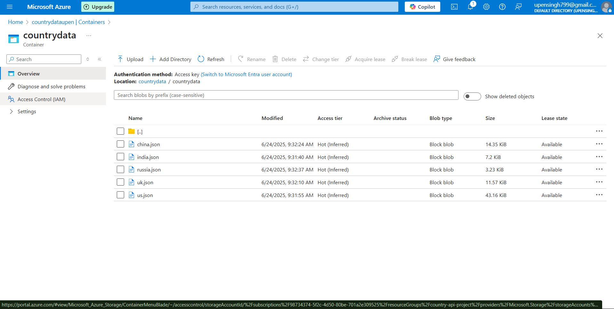

# 🌍 Azure Data Factory – Country Data Pipeline

## 📌 Task – Fetch & Store Country Data from REST API

This Azure Data Factory pipeline fetches data from the REST API:  
`https://restcountries.com/v3.1/name/{country}`  
for the following countries:

- 🇮🇳 India  
- 🇺🇸 United States  
- 🇬🇧 United Kingdom  
- 🇨🇳 China  
- 🇷🇺 Russia

Each country's data is saved as a separate `.json` file in **Azure Data Lake Storage (ADLS)** with the file name equal to the country name.

---

## 🏗️ Pipeline Architecture

- A **ForEach** loop iterates over the country names stored in a variable.
- The pipeline dynamically calls the REST API using a parameterized dataset.
- Each API response is written to ADLS in **JSON** format using a **Copy** activity.

---

## 🔁 Pipeline Visual Overview

### 📊 Azure Data Factory Pipeline View

> This shows the entire flow that automates country-wise REST API data fetching and saving:

---

## ⏰ Scheduled Trigger Configuration

> The pipeline is automatically executed **twice a day** using a time-based trigger at:

- 🕛 **12:00 AM IST**
- 🕛 **12:00 PM IST**

### 📅 Trigger Setup Screenshot:

---

## 📁 Output Preview in ADLS

> Each API response is saved in the following location:

`/countrydata/{country_name}.json`

Example output files:
- `india.json`
- `us.json`
- `uk.json`
- `china.json`
- `russia.json`

### 📂 Output Screenshot:

---

## 🔧 Technical Summary

| Component         | Description                                                |
|------------------|------------------------------------------------------------|
| **Pipeline Name** | `FetchCountryDataPipeline`                                |
| **Trigger Type**  | Scheduled Trigger (12AM & 12PM IST)                       |
| **Activity Type** | `ForEach` + `Copy`                                        |
| **Source**        | REST API – `https://restcountries.com/v3.1/name/{name}`   |
| **Sink**          | ADLS Gen2 (AzureBlobFS)                                   |
| **File Format**   | JSON                                                      |
| **File Naming**   | Dynamic file name equal to country name                   |
| **Parameterization** | Dataset & file names are parameterized dynamically     |

---

## 💾 Pipeline Export

You can view the full exported JSON of this pipeline here:  
📄 [pipeline_export.json](./pipeline_export.json)

---

## ✅ Project Status

- ✔️ Successfully deployed on Azure Data Factory  
- ✔️ Automated via schedule  
- ✔️ Dynamic REST API fetch and JSON storage validated  
- ✔️ Country data correctly lands in ADLS as separate files

---

## 🙌 Contributors

Made with 💙 by **Upen Singh**  
📬 `upensingh799@gmail.com`  
🎓 CSI Internship Project

---

