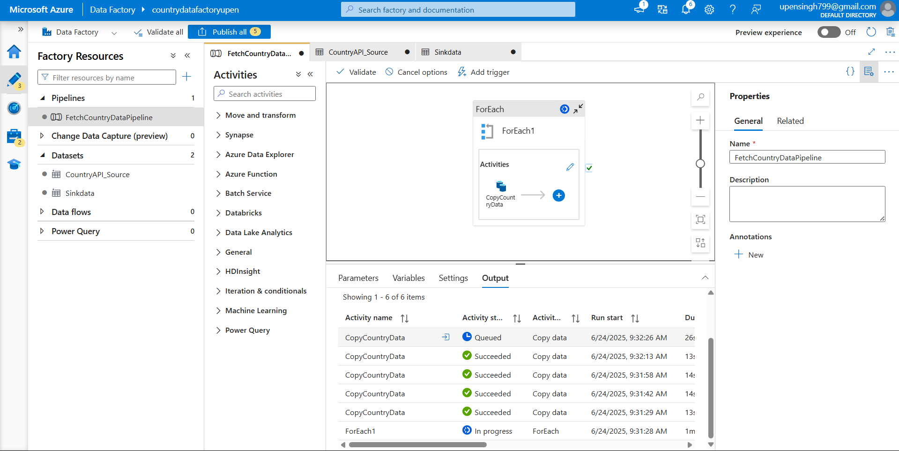
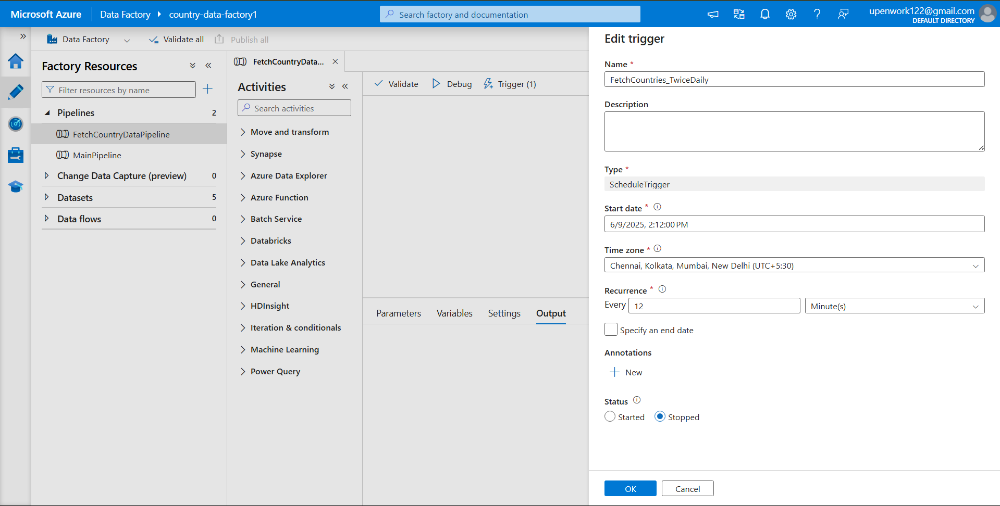

# 🌍 Azure Data Factory – Country Data Pipeline

## 📌 Task 1 – Fetch & Store Country Data Using REST API

This pipeline fetches data from `https://restcountries.com/v3.1/name/{country}` for the following countries:

- 🇮🇳 India  
- 🇺🇸 United States  
- 🇬🇧 United Kingdom  
- 🇨🇳 China  
- 🇷🇺 Russia

The pipeline saves the result as individual `.json` files in Azure Data Lake Storage.

---

## 🏗️ Pipeline Logic

- A **ForEach loop** iterates over the list of countries stored in a variable.
- It dynamically calls the **REST API** using a parameterized dataset.
- It uses a **Copy activity** to write each response to Azure Data Lake Storage in **JSON format**.

---

## 📸 Visual Preview

### 🧪 Pipeline in Azure Data Factory

> Upload a screenshot and rename it as `pipeline_view.png`

---

### ⏰ Scheduled Trigger Configuration

This pipeline is automatically triggered at:

- **🕛 12:00 AM IST**
- **🕛 12:00 PM IST**

> Upload a screenshot and rename it as `trigger_config.png`

---

## 🔧 Technical Details

| Component        | Description                                             |
|------------------|---------------------------------------------------------|
| **Pipeline Name**| `FetchCountryDataPipeline`                              |
| **Activity Type**| `ForEach` loop with `Copy` inside                       |
| **Source**       | REST API (RestSource)                                   |
| **Sink**         | Azure Data Lake (JsonSink)                              |
| **Storage**      | Azure Blob FS / ADLS Gen2                               |
| **Trigger**      | Time-based schedule at 12 AM & 12 PM IST daily          |

---

## 📄 JSON Pipeline Definition

[View Full Pipeline JSON](./pipeline_export.json)

---

## 🧠 Notes

- The REST API supports multiple parameters but this implementation uses one country at a time to avoid throttling.
- Error handling and retry policy can be enhanced with ADF built-in features.

---

## 📌 Status

✅ Successfully tested and deployed in Azure Data Factory  
✅ Scheduled automation verified  
✅ Output files successfully landed in ADLS

---
