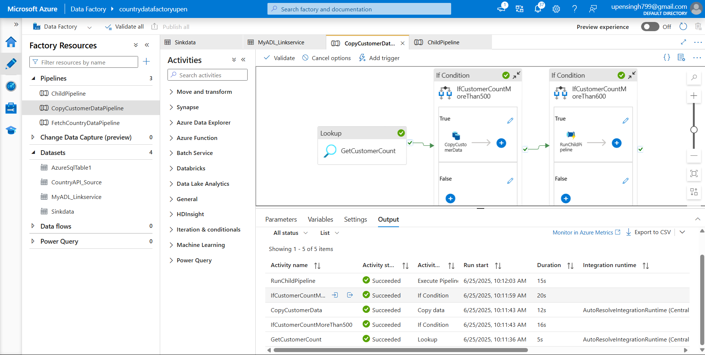
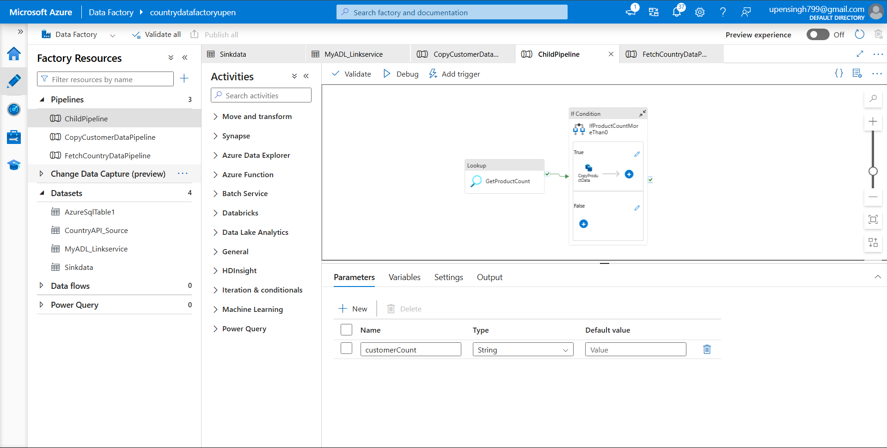
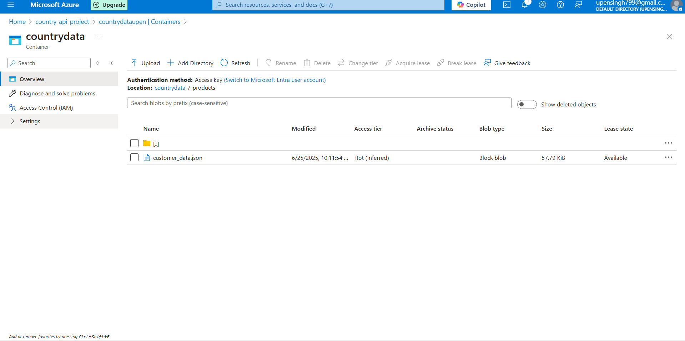
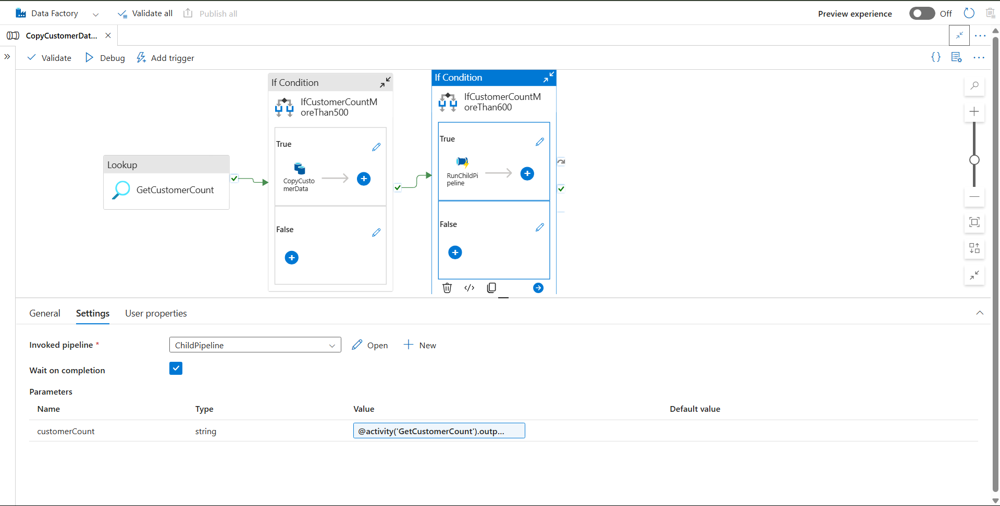

# 🔄 Azure Data Factory – Customer & Product Conditional Copy Pipeline

## 📌 Task Overview

This solution contains two connected pipelines that handle conditional data transfer from an Azure SQL Database to Azure Data Lake (ADLS):

1. ✅ Copy **Customer** data to ADLS **if record count > 500**  
2. 🔁 If **Customer count > 600**, trigger a **Child Pipeline** to copy **Product** data  
3. 📦 Data is stored in ADLS as **JSON** files  
4. 🔗 **Customer count** is passed to the **child pipeline** as a parameter for dynamic processing  

---

## 🏗️ Pipeline Architecture

### 🔹 Main Pipeline Logic

- Performs a **Lookup** to get the customer record count.
- Uses **IfCondition** to check `count > 500`
- Executes **CopyCustomerData** if condition is met.
- Triggers **ChildPipeline** if `count > 600`, passing the count via **pipeline parameter**.

### 🔹 Child Pipeline Logic

- Accepts `customerCount` from the parent pipeline.
- Performs **Lookup** on `Products` table.
- If product count > 0, copies data to ADLS.
- Uses dynamic naming for product output like:  
  `product_data_{customerCount}.json`

---

## 🧩 Visual Flow – Main Pipeline



---

## 🧩 Visual Flow – Child Pipeline



---

## 📂 Output Files in ADLS

Files generated and stored in **ADLS Gen2**:

- ✅ `customer_data.json`
- ✅ `product_data_610.json` (if customerCount = 610)



---

## 🔁 Parameter Passing – Parent to Child

The `CopyCustomerDataPipeline` passes the value of `customerCount` to the `ChildPipeline`.

### 🧬 Parent Pipeline Snippet

```json
{
  "pipeline": {
    "referenceName": "ChildPipeline",
    "type": "PipelineReference"
  },
  "waitOnCompletion": true,
  "parameters": {
    "customerCount": "@activity('GetCustomerCount').output.firstRow.count"
  }
}
```

### 📥 Child Pipeline Parameters

```json
"parameters": {
  "customerCount": {
    "type": "string"
  }
}
```

📁 **Example Output File**  
If `customerCount = 610`, then the output file will be:

```
product_data_610.json
```

🖼️ ## Parameter Passing   


---

## ✅ Project Task Completion

- [x] Task 1: Fetch country data from REST API  
- [x] Task 2: Setup time-based trigger  
- [x] Task 3: Conditional copy of customer & product data  
- [x] Task 4: Parameter passing from parent to child pipeline  

---

## 🧠 Technical Summary

| Component              | Description                                         |
|------------------------|-----------------------------------------------------|
| **Main Pipeline**      | `CopyCustomerDataPipeline`                          |
| **Child Pipeline**     | `ChildPipeline`                                     |
| **Source DB**          | Azure SQL Database                                  |
| **Sink**               | Azure Data Lake Storage Gen2                        |
| **Format**             | JSON                                                |
| **Trigger Condition**  | Customer count > 500 and > 600                      |
| **Dynamic Filename**   | `product_data_<customerCount>.json`                |
| **Parameter Used**     | `pipeline().parameters.customerCount`              |

---

## 📄 Pipeline Definitions

- 🔗 [Main Pipeline JSON](./Main_pipeline.json)  
- 🔗 [Child Pipeline JSON](./Child_pipeline.json)  

---

## 👨‍💻 Developed By

**Upen Singh**  
📧 `upensingh799@gmail.com`  
🎓 CSI Internship Project 2025  
